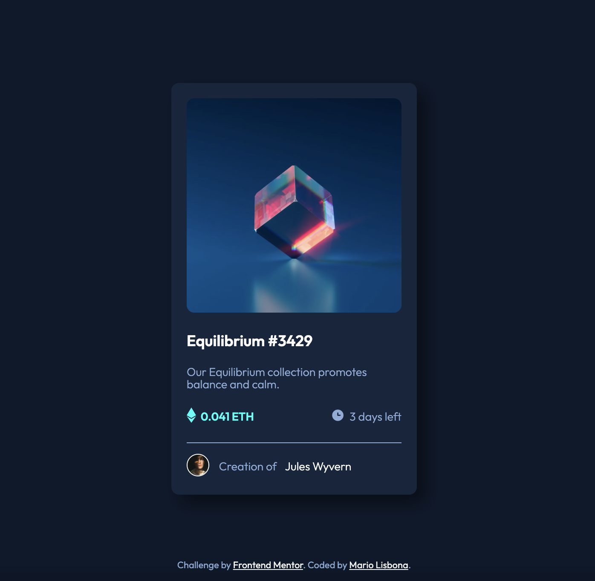
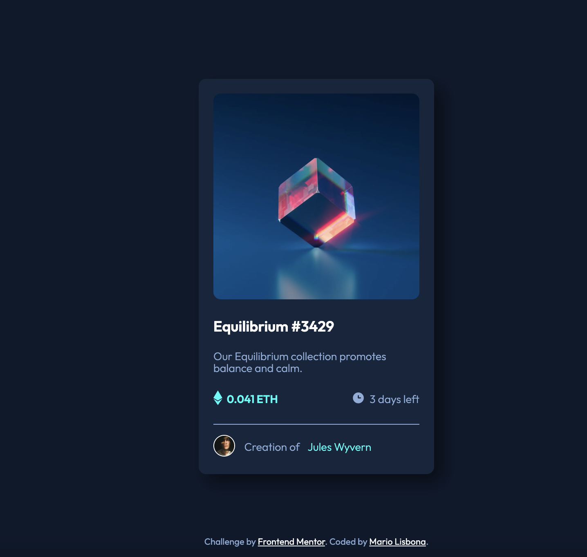
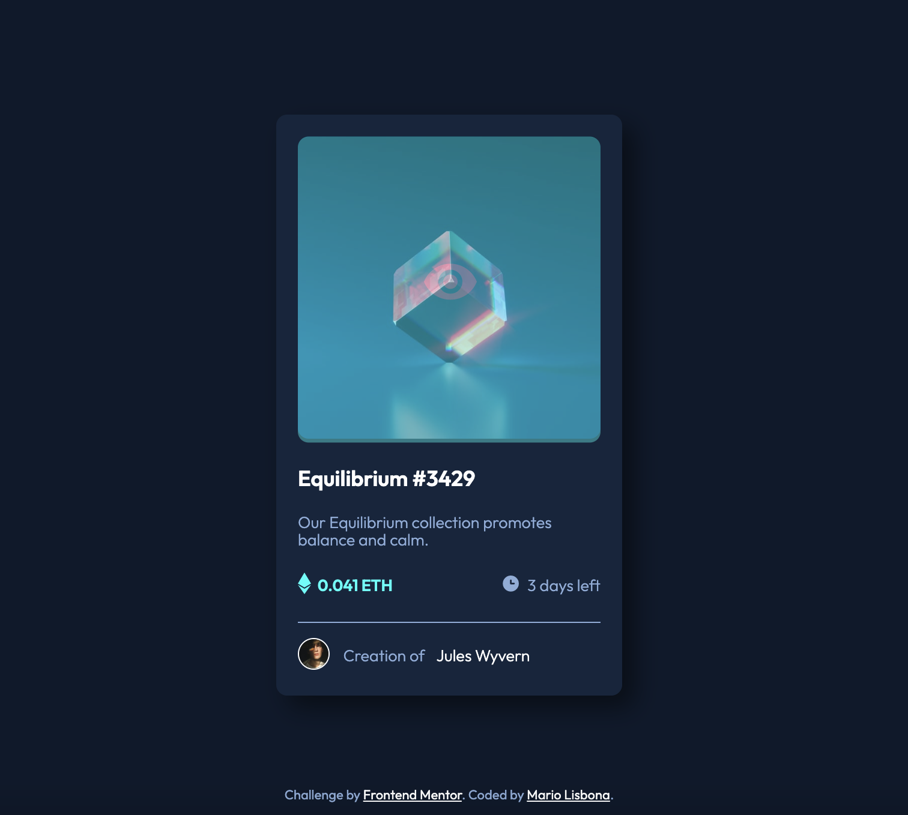

# Frontend Mentor - NFT preview card component solution

This is a solution to the [NFT preview card component challenge on Frontend Mentor](https://www.frontendmentor.io/challenges/nft-preview-card-component-SbdUL_w0U). Frontend Mentor challenges help you improve your coding skills by building realistic projects. 

## Table of contents

- [Overview](#overview)
  - [The challenge](#the-challenge)
  - [Screenshot](#screenshot)
  - [Links](#links)
- [My process](#my-process)
  - [Built with](#built-with)
  - [What I learned](#what-i-learned)
  - [Continued development](#continued-development)
  - [Useful resources](#useful-resources)
- [Author](#author)

**Note: Delete this note and update the table of contents based on what sections you keep.**

## Overview

### The challenge

Users should be able to:

- View the optimal layout depending on their device's screen size
- See hover states for interactive elements

### Screenshot

### Links

- Solution URL: [Add solution URL here](https://github.com/MarioLisbona/FEM-nft-preview-card)
- Live Site URL: [Add live site URL here](https://mariolisbona.github.io/FEM-nft-preview-card/)

## My process

I used the same process as in my previous solutions. I set all elements to box-sizing: border-box and reset h1, h2, h3 and p elements to no margin and no padding.

I created variables for the colors.
I created the outter card and usedd flex-box to align all the divs vertically.
I created a horizontal flex box for the ETH price and time remaining. I also created 2 nested horrizontal flex boxes for the ETH icon/price and clock icon/time.
The last flexbox was at the bottom for the creator information. I used the top border to display the horrizontal line.

I struggled a bit with the cyan overlay ontop on the hero image. I initially tried an ::after pseudo element and it worked but i couldnt have the image at full opacity while having the cyan and half opacity.

I tried a second option with a sibling div to the hero image and set its opacity to 0. And then in its hover state set the opacity to 0.5. I thought i would be able to have the eye image as an initial state of 0 opacity and hover state of 1. This didnt work and it keeps the 0.5 opacity of the overlay div. I couldnt figure it out after alot of reseraching. I'll leave it for now and ask for some advice.

### Built with

- Semantic HTML5 markup
- CSS custom properties
- Flexbox

### What I learned

This was the fist time i tried using ::after and the transform: translate method to position pseudo elements in one of my own projects. I got the hang of it but tried a different method afterwards using initial opacity of 0 and a hover state opacity of 1.

I changed the mobile version to have active states instead of hover as they dont happen on mobile.

### Continued development

I will research more on having a background opacity lower than the opacity of the overlay image.

### Useful resources

- [Example resource 1](https://courses.webdevsimplified.com/) - This course was great and helped me to use CSS.

## Author

- Frontend Mentor - [@yourusername](https://www.frontendmentor.io/profile/MarioLisbona)
